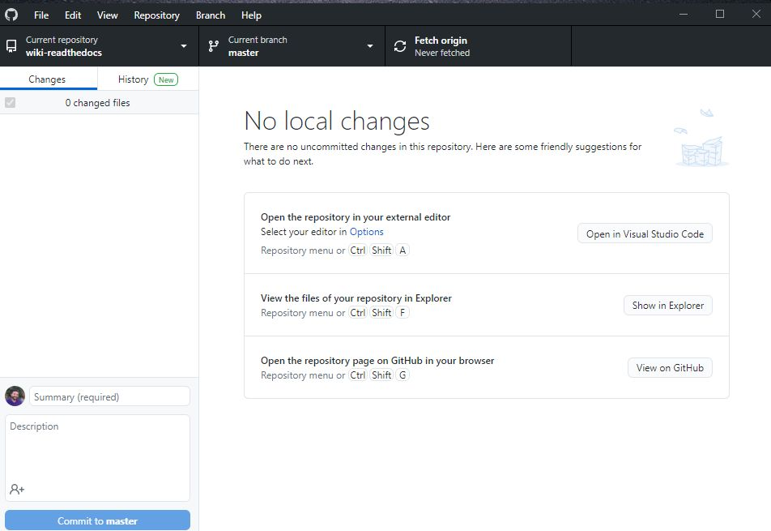
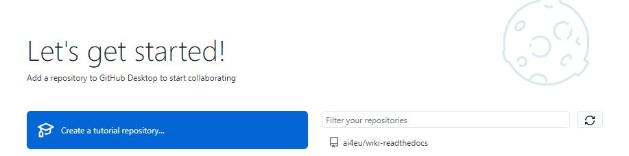
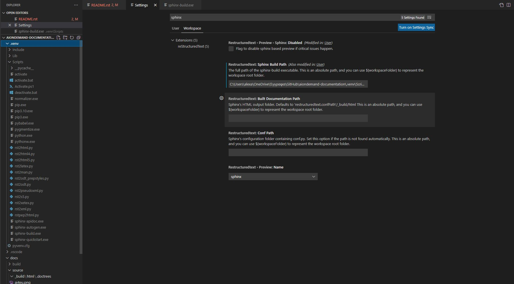
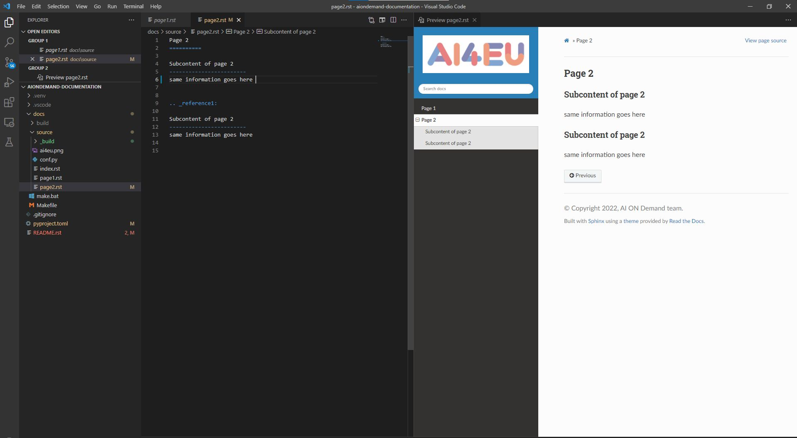

====================================
AI on Demand documentation
====================================

This repository contains the documentation available at `readthecods <https://aiondemand.readthedocs.io/en/latest/>`_

***************
How it works
***************

The documentation is written in RestructuredText markup syntax. You can view the syntax `here <https://docutils.sourceforge.io/docs/user/rst/quickref.html/>`_  or by visiting an `online editor <https://livesphinx.herokuapp.com/>`_.

The documentation is compiled to an html website using the `Sphinx Python Documentation Generator <https://www.sphinx-doc.org/en/master/tutorial/getting-started.html#setting-up-your-project-and-development-environment/>`_ You have to download the code and have the proper tools installed in order to build the documentation. See section below  **How to start using windows**  for an intro guide of the tools that you will need to install.

Every time a push is made to the repository's branch `latest <https://github.com/ai4eu/wiki-readthedocs/tree/latest/>`_, a trigger is build at `readthedocs <https://aiondemand.readthedocs.io/en/latest//>`_. Readthedocs is responsible for a) hosting the generated documentation for free b) automatically building the documentation when a change is pushed at Github

The flow for a documentation maintainer
======================================================================
- Download the latest version of the code to your local pc (via *git clone* or *git pull*)
- Make changes to the code to your local pc
- Compile the documentation everytime you make changes, to make sure any RestructuredText mistakes are corrected
- Push the code back to github
- If the code is pushed to the `latest <https://github.com/ai4eu/wiki-readthedocs/tree/latest/>`_ branch, a built will be automatically triggered resulting into a new released version of the documentation

Usefull links
======================================================================
-  `Online editor <https://livesphinx.herokuapp.com/>`_ can help you get familiar with the syntax
-  `ReStructuredText intro <https://docutils.sourceforge.io/docs/user/rst/quickstart.html/>`_ has all the available syntax commands
-  `Sphinx Themes Gallery <https://sphinx-themes.org//>`_ has a list of themes that can be used to build the documentation
-  `Sphinx documentation Generator <https://www.sphinx-doc.org/en/master/tutorial/getting-started.html/>`_ contains information about how to compile and build the documentation

******************************
How to start using windows
******************************

This guide assumes that you have minor experience to github.
It will help you install

- The development tools required in order to build the documentation
- A github client
- An editor to write the documentation along with the required dependencies (python and Sphinx related packages)

Setting up the development tools
============================================================
Install Python 
https://www.microsoft.com/el-gr/p/python-310/9pjpw5ldxlz5?rtc=1&activetab=pivot:overviewtab 

Setting up an editor
============================================================
Install Visual Studio Code https://code.visualstudio.com/  

Install **python extension** at Visual Studio code https://marketplace.visualstudio.com/items?itemName=ms-python.python (when asked open the link directly via Visual Studio code)
Install **restructuredtext extension** at Visual Studio code https://marketplace.visualstudio.com/items?itemName=lextudio.restructuredtext 
Install **reStructuredText Syntax highlighting** at Visual Studio code  https://marketplace.visualstudio.com/items?itemName=trond-snekvik.simple-rst

Setting up Github Client
============================================================
Install `Github desktop <https://desktop.github.com//>`_  sign in with your github account and select the aiondemand project

Setting up the development environment
============================================================
- On visual studio code open the project
- Create a virtual environment d
 > python -m venv .venv

Follow the instructions https://code.visualstudio.com/docs/python/python-tutorial#_select-a-python-interpreter  and select the virtual environment

Install sphinx in this environment.
    pip install -U sphinx

Install the theme
    pip install -U sphinx_rtd_theme

Set up the sphinx path at visual studio code
https://docs.restructuredtext.net/articles/configuration.html

Compiling the documentation manually
============================================================
Run .\make.bat html

