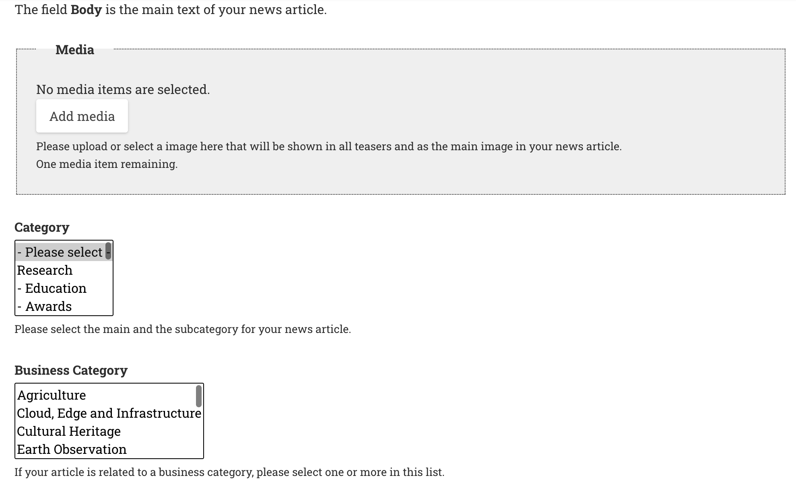

Understanding the User Interface
==========

Accessing the AI-on-demand Platform through the EU login
------------------------
To fully benefit from the platform’s services, 
such as the Experimentation service or to add 
content to the platform through the `Collaboration <https://www.ai4europe.eu/collaboration>`_,
page you must log on to the platform with the `EU login
<https://webgate.ec.europa.eu/cas/login?loginRequestId=ECAS_LR-16714259->`_,
which is the European Commission's single sign-on user authentication service. Using the Experiments service as an authenticated user, for example, allows you to upload AI resources such as data or models and create your own AI solutions. 
The EU login allows you to access to a wide range of web services, using a single email address and password. The EU login is manufacturer-independent and has more than 6 million active users from the European Commission, EU institutions and agencies as well as external users. It is quick and easy to create an EU login account. Alternatively, you can gain access via selected social media accounts.

If you already possess a login for the platform, we recommend using the same email address for the new EU login procedure. Your email address serves as identifier to seamlessly map your account. In this way, you can get a quick overview of your past contributions, such as the resources you already uploaded.

To sign in to the platform follow these simple steps:

1. If you do not already have an EU login you may create an account `here <https://webgate.ec.europa.eu/cas>`_
    .. image:: ./images/eu-login-01.png

2. Click on the symbol with the arrow in the top right corner on the `AI on demand <https://www.ai4europe.eu/>`_
    .. image:: ./images/eu-login-02.png

3.	Click on the blue EU Login button
    .. image:: ./images/eu-login-03.png

4.	Sign in using your AI login
    .. image:: ./images/eu-login-04.png

5.	Once you are logged in you can click on the person icon in the top right corner to see your content and account details
    .. image:: ./images/eu-login-05.png

6.	You will then find an overview of the content you have created along with its moderation state (e.g. published or under review) and an option to submit new content
    .. image:: ./images/eu-login-06.png

How to add content to the platform
------------------------

.. _referencia1:

To be able to add content to the platform you must log in using your EU login. 
Go to the `Collaboration <https://www.ai4europe.eu/collaboration>`_ 
where you can select what type of content you would like to add,
ranging from news and events to case studies.

Watch this `video-tutorial <https://www.ai4europe.eu/education/education-catalog/publishing-contents-ai-demand-platform>`_ 
on how to contribute your own contents.

.. image:: ./images/collaboration-02.png
  :width: 400
  :alt: Alternative text

This collaboration page is accessible through seven of the main pages, Home, AI Community, Business and Industry, Research, Education, Ethics, and News and Events.

Running example of adding a news item to the platform
------------------------

Chose through the Collaboration page the news item and click on add it button.

You can then add media (e.g. an image) and select the category and business category the content falls under to link your content to the relevant pages.

Once you have inputted all the necessary information you can then click on save. 
After you have submitted your content, it will go through a review process before it can be published. 

.. image:: ./images/add-content-03.png
  :width: 400
  :alt: Alternative text

To view if your content has been published you may check your content in your account (see step 5 and 6 of Accessing the AI-on-demand Platform through the EU login).

Publishing your research results in a "Research Bundle"
------------------------

A "research bundle" on the AI-on-demand platform (ai4europe.eu) is meant to collect in a single place all the TANGIBLE OUTPUTS (code, data, tutorials, ...) produced by a small research project, like a Humane-AI-Net micro-project, and published anywhere.  Note that a research bundle is NOT meant to only describe the project or its planned (as opposed to actual) activities and results.

To create a "research bundle" for your small project, you can follow this `video-tutorial <https://www.ai4europe.eu/education/education-catalog/publishing-contents-ai-demand-platform>`_.  Then, you can link your "bundle" to the relevant tangible outputs as follows:

1. If your output is already published on the AI on-demand platform, then edit the research bundle, find the "All entities" option in the pop-in menu on the left border, and select "Add existing entitiy".  You can add any node already on the platform, like organizations, AI assets (datasets, software, etc), educational contents, and so on.  Just type the first letters in the "Title" field of the "Add entity" form to find it.  You can also add members to the bundle by their (ECAS) user name: they will have the right to edit the bundle.

2. If your output is not published on the platform yet, use the above video tutorial to publish it.  It will go through an editorial process: once approved, you will be able to add it to your bundle.

3. If you want to link your "bundle" to something which is not published on the platform, e.g., a paper on Zenodo, simply edit your bundle and put a link to it in the "Additional information" field.  You can use the small chain icon in the editing box to put a URL link.  (Note: we do not directly store publications on the platform since they are usually already archived in some exernal place.)

At the bottom of your "research bundle" you will see a list of all the contents on the platform that are linked to it.  Note that the same content can be linked to more than one bundle: this is usually the case for organization.

.. :Authors:
    Gabriel G. Castañé,
    Melissa Brunner
    (and sundry other good-natured folks)
.. :Version: 1.0 of 2022/03/09
