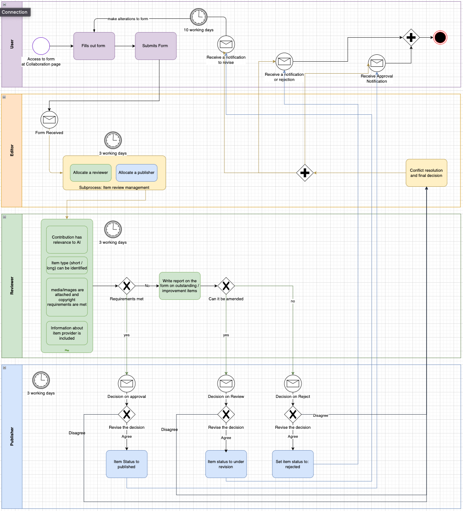

Editorial and Publication Processes
==========

Roles and publication process
------------------------

There are four main roles in the governance of the AI-on-demand platform, namely users, editors, reviewers, and publishers. The Figure shows how the governance process begins when a
user adds content as described in :ref:`reference1`. After the content has been submitted by the user, the editors of the platform will receive a notification and allocate a reviewer and a publisher within 3 working days. The next step in the governance process is then taken by the reviewer, who checks within 3 working days whether the content that has been submitted is relevant to AI, if the item type is correct, that copyright requirements are met for media and images and that information about the item provider is included.

- If all requirements are met, the reviewer will recommend publication and pass the item on to a publisher for a decision on approval. The publisher will then either agree with the decision of the reviewer and publish the item or they will disagree and pass the item on to the editor for a final decision.
- If the requirements are not met, the reviewer will write a report on the form of outstanding items or required improvement in the review comments section.
- If the outstanding items or issues can be amended, the reviewer will recommend amendments, deciding on another review.
- If amendments cannot be made, the reviewer will recommend rejection of the item the user has submitted.
- The item is then passed on to a publisher

The publisher then reviews the assessment of the reviewer within 3 working days.

- If the reviewer has recommended publication, the publisher will either agree and publish the content or disagree and revert the final decision to the editor.
- If the reviewer has recommended review, the publisher will either agree and a notification will be sent to the user to revise the content, or the publisher will disagree and revert the final decision to the editor.
- If the reviewer has recommended rejection, the publisher will either agree and reject the content or disagree and revert the final decision to the editor.

At the end of the review process the user will either receive a notification to revise their content, a notification of rejection, or a notification of approval.