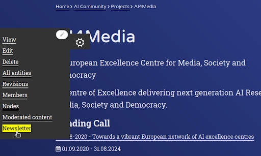
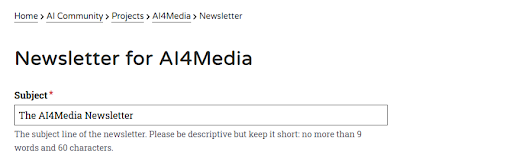
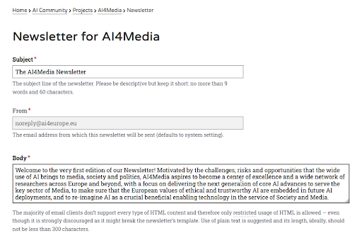
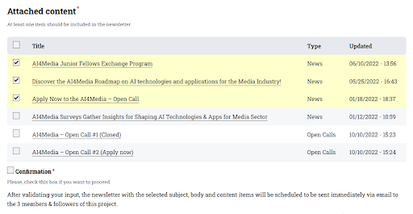
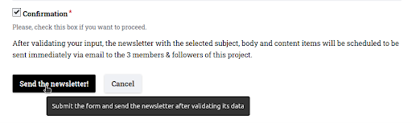

Projects
=======================================================

The Newsletter tool is a new feature that enables the owners of Projects hosted on the AI-on-Demand Platform's CMS to send an email newsletter to all members of the platform. The newsletter contains a custom subject and introductory text, as well as links, summaries, and images of selected relevant content (e.g. news, open calls, etc.). This tool was built as a custom module for Drupal 9.x by Demokritos.
The Newsletter is an important addition to the AIoD Platform, as it provides several benefits to Project owners and members. These benefits include:
The ability to easily and efficiently send newsletters to all members of a Project, providing them with timely updates and relevant information.
The ability for visitors of the platform to easily "connect" with Projects they are interested in, in order to stay informed and engaged with the Project, even if they do not actively participate in its proceedings.
The simplification of the process of following a Project, making it easy for users to stay up-to-date with the latest developments and news related to the Project.
The potential for future developments in community building, such as providing members with access to additional resources and information directly related to their interests. This can help to build a stronger and more engaged community around the Project.

*Following* a Project
-------------------------------------------------------

**Any** member of the Platform can *follow* **any** Project! That's how people can
easily "*connect*" themselves with a Project they might be interested in, even
if they don’t actually participate in its proceedings.

All it takes to follow a Project is to visit the Project’s page on the site and
to click on the “**Follow Project!**” button:

Clicking the button sets things in motion. A new modal window is presented with
further information and buttons that provide actions. Registered users can just
click Follow again to confirm their choice. Unregistered users or users who
haven’t signed are redirected to the login page.

For now, followers have access to Newsletters sent by the Projects owners.

But that is just the beginning: In the future, followers can easily have access
to additional information and resources compared to outsiders (registered users
of the platform who are not members of a Project). Furthermore, this function
opens up numerous possibilities for community building: For example, every
Project in the future could have a list of followers and “participants”
(people actively working on a Project), while every user could have the list of
the Projects they follow or participate on their profiles!

Newsletter tool for Project owners
-------------------------------------------------------

The Newsletter tools allows the owner(s) of a Project on the AIoD Platform’s CMS
to send an email Newsletter to all its members. The newsletter contains a custom
subject and introductory text, as well as links, summaries, and images of
selected relevant content (e.g. News, Open Calls, etc.).

The Newsletter is an important addition to the AIoD Platform, as it provides
several benefits to Project owners and members. Members can easily connect with
the Projects they are interest in and they will be kept informed with timely
updates and relevant information.

How can a Project owner share content via a Newsletter?
~~~~~~~~~~~~~~~~~~~~~~~~~~~~~~~~~~~~~~~~~~~~~~~~~~~~~~~

There is a significant amount of engaging content that is published on the CMS
on a weekly basis. However, unless users take the initiative to visit the site,
they may not have the opportunity to view this content. By receiving a
newsletter that includes the latest updates and insights related to the Projects
they have chosen to follow, users can stay informed about any important events
or developments.

Step 1. Go to the Newsletter tool
#######################################################

Project owners can easily start building a Newsletter using the relevant option
from the “Local tasks” side-menu of their Project which as usual provides
access to all options related to the management of the Project:

Step 2. Pick a subject
#######################################################

The Subject is really important as it’s going to be the Subject of the email
itself and also the Title at the header of the Project’s Newsletter. A sensible
default is automatically set, although Project owners should provide their own -
they can certainly leave out the Project's name as that will always appear on
the Newsletter, right below the Platform’s logo.

**Validation rules:** Subject should not be less than 10 characters or longer than 90
characters. There are many articles and researches that define the optimal
subject length, but as a rule you should keep in mind that notifications which
appear on mobile screens are usually truncated at about 40 characters.

Step 3. Write an introductory text (*body*)
#######################################################

The body is the introductory text of the Newsletter and appears right underneath
the platform’s logo and the title (Subject). It should contain a personalised
message from the Project owner to all the Project’s members. Usually, it
contains the most important information for people who are short on time.

**Validation rules:** Body should not be less than 200 characters. As its purpose is
to put the most important information first, it should at least be longer than a
SMS. Only restricted usage of HTML is allowed: Links within the CMS, simple
lists, quotes and other elements can be used. More details about how to utilise
restricted HTML are provided via the modal that appears by clicking the dotted
link (restricted).

Step 4. Pick interesting and relevant content
#######################################################

Project Owners have already added a lot of related content to their Project.
They can now easily share that content with all the members of a Group, just by
selecting it with a checkbox. The content is sorted in reverse chronological
order and the selected items are indicated with a bright yellow colour.Nothing
else needs to be done: The newsletter will contain the title, the link and the
short summary of each item (*images will be resized and optimised automatically
for an email*).

**Validation rules:** At least one content item should be selected. It’s not
allowed to send all content items, unless their total number is less than 4.
These restrictions were set in order to: a) make sure that the Newsletter sent
contains at least one link that readers can follow to read more relevant
information, b) avoid sending all the content items by accident as the checkbox
next to the “Title” does exactly that.

Step 5. Confirm your choices & sent the newsletter!
#######################################################

It’s not possible to send a Newsletter without checking the Confirmation
*checkbox*. This ensures that no Newsletter is sent by accident, while providing a
short summary of the action (*"will be sent immediately via email to the N
members of this project"*).

